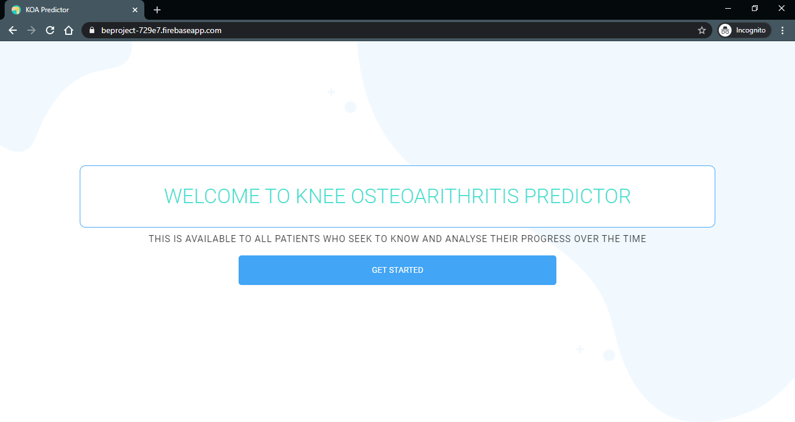
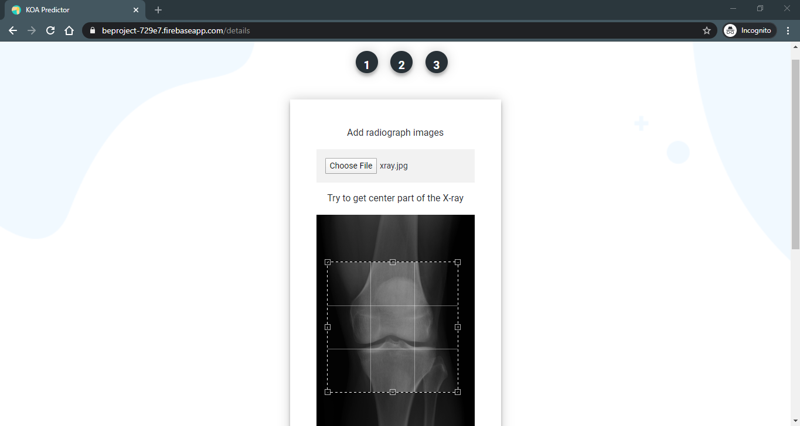
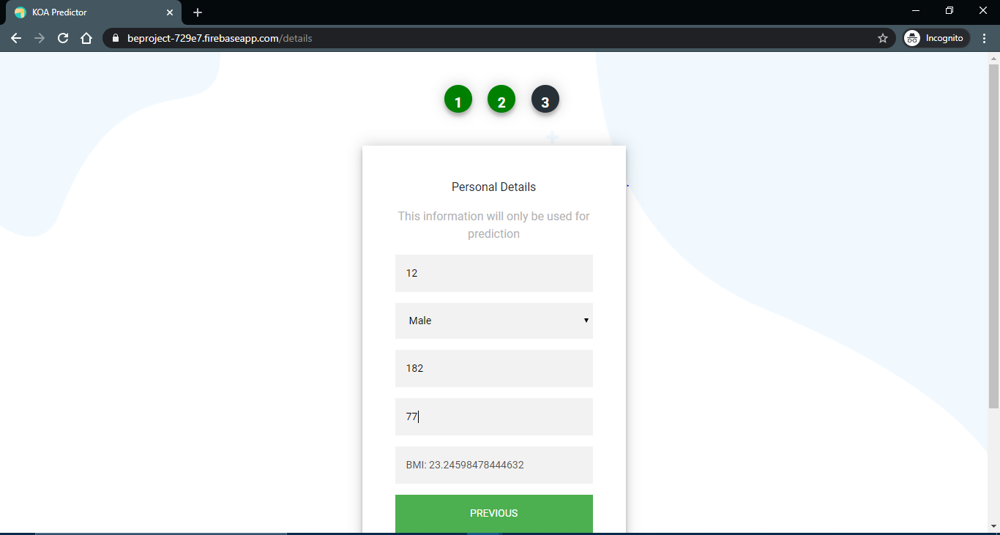
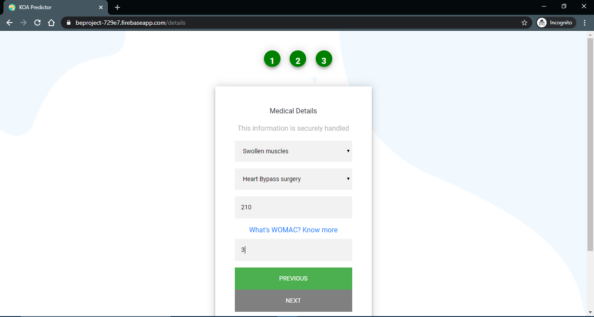
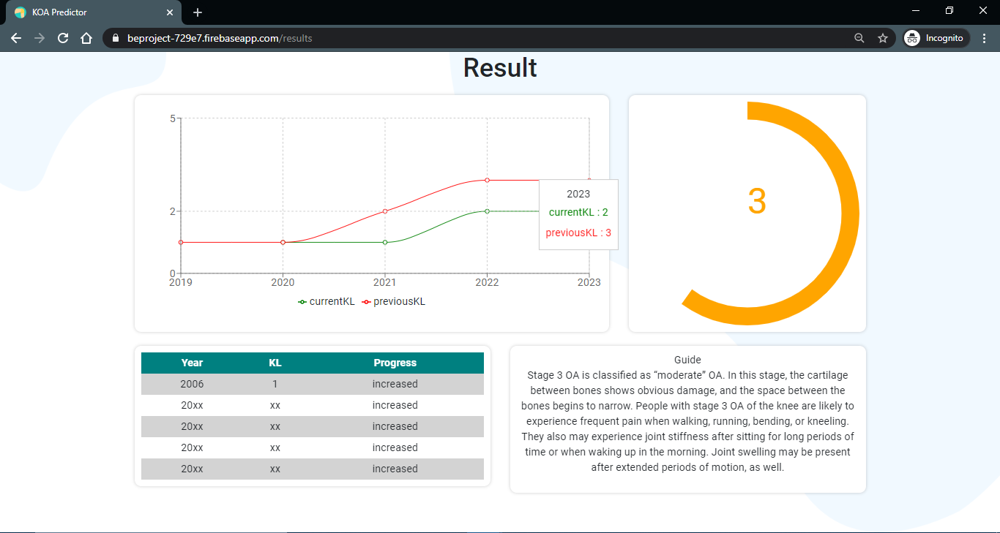

Knee osteoarthritis is currently diagnosed by assessing symptoms and evaluating the radiograph manually by the practitioner. We propose a computer-aided diagnosis method to automatically evaluate score knee Osteoarthritis severity according to KL scale. This method allows transparent and fair diagnosis that is not subjective and based on previous data and medical parameters. Data set of radio-graphs classified with KL levels related to knee osteoarthritis will be used for training and the patient may know the severity of osteoarthritis in future time periods so that he will be able to take necessary precautions. We will use the Deep Siamese Convolutional Neural Network to train and test radiograph images comparing symmetry of image to evaluate osteoarthritis severity.  
  
This is the Front-End made in React (Under Progress)  
Project live at : https://beproject-729e7.firebaseapp.com/  

Few snaps:  
  
  
 
 
 
 
 
 

